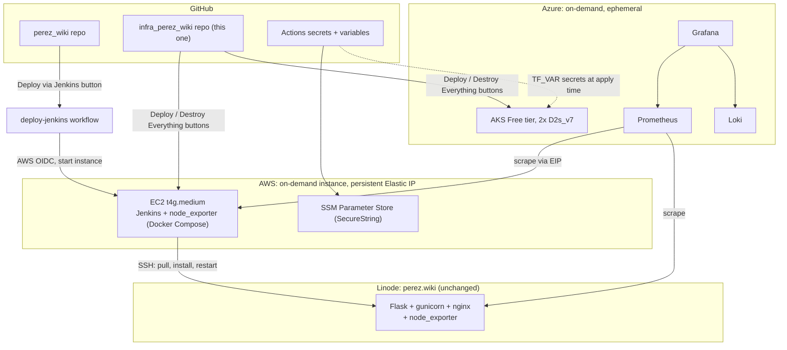

# infra_perez_wiki

Infrastructure for a Jenkins CI cluster (AWS) and a Grafana/Prometheus/Loki monitoring
stack (Azure), built around my [perez_wiki](https://www.perez.wiki) website. A 
demo of some basic terraform and cloud concepts.

## Architecture
*Chart produced by Anthropic's Claude*


## Setup

1. Apply the persistent configs by hand: `bootstrap/aws`, `bootstrap/azure`,
   `aws/jenkins/iam`, `azure/monitoring/iam`. They hold the state backends, OIDC
   trust, and the Jenkins Elastic IP, all of which must outlive the ephemeral
   stacks. Each has its own README.
2. Set the repo secrets and variables (see [Secrets](#secrets)).

## Usage

Everything runs from this repo's **Actions** tab. 

- **Deploy Everything** / **Destroy Everything** - both stacks at once, in parallel.
- **Deploy Jenkins** / **Destroy Jenkins** - AWS
- **Deploy Monitoring** / **Destroy Monitoring** - Azure

A successful deploy writes the access commands into the summary panel.

## Repo layout

Each directory has its own README with more information.

```
bootstrap/
  aws/      Remote state backend (S3) for aws/jenkins. Applied once.
  azure/    Remote state backend (Storage Account) for azure/monitoring.
            Applied once.
aws/
  jenkins/
    iam/      OIDC provider, IAM roles, persistent Elastic IP. Applied once.
    compute/  EC2 instance, security group, SSM parameters. On-demand.
azure/
  monitoring/
    iam/    Azure AD app registration, federated credentials, RBAC. Applied once.
    aks/    AKS cluster + Helm releases for Grafana/Prometheus/Loki. On-demand.
.github/workflows/
  deploy-jenkins.yml       Build/apply the AWS Jenkins stack.
  destroy-jenkins.yml      Tear down the AWS Jenkins stack.
  deploy-monitoring.yml    Build/apply the Azure monitoring stack.
  destroy-monitoring.yml   Tear down the Azure monitoring stack.
  deploy-everything.yml    Deploy both stacks in parallel.
  destroy-everything.yml   Destroy both stacks; leaves bootstrap/iam/EIP alone.
```

## Secrets

- **GitHub Secrets** :
  - `LINODE_SSH_PRIVATE_KEY` - SSH key Jenkins uses to deploy to the Linode box
  - `JENKINS_ADMIN_PASSWORD` - the Jenkins `admin` user password
  - `EXPORTER_BASIC_AUTH_HASH` - bcrypt hash for the Jenkins node_exporter's basic auth
  - `ADMIN_CIDR` - the IP allowed to reach the Jenkins UI (port 8080)
  - `GRAFANA_ADMIN_PASSWORD` - the Grafana `admin` password
  - `LINODE_EXPORTER_PASSWORD` - password Prometheus sends to scrape the Linode box
  - `JENKINS_EXPORTER_PASSWORD` - password Prometheus sends to scrape the Jenkins box

- **GitHub Variables** :
  - `JENKINS_EXPORTER_TARGET` - the Jenkins Elastic IP as `host:port`

- **External Secrets**
- *AWS side:* SSM Parameter Store, Standard tier, `SecureString` type, encrypted
  with the AWS-managed KMS key (`aws/ssm`) to stay completely free.
- *Azure side:*  values come from Terraform variables
  (`grafana_admin_password`, `linode_exporter_password`), set as `TF_VAR_*`
  environment variables and injected into the Helm releases at apply time.
  See azure/monitoring/aks/README.md

## Cost (on-demand, fully ephemeral)

You might be saying - that seems backwards. Why is your monitoring ephemeral and
your app persistent? Well, I don't have 230 bucks a month to burn on a small app
that is mainly evidence of my being able to do some basic stuff in the cloud.

| Piece | Compute | Per demo-hour | Always-on equivalent (for context) |
|---|---|---|---|
| AWS: EC2 t4g.medium, Jenkins | ~$0.034/hr | ~$0.034/hr | ~$24.82/mo |
| Azure: AKS Free tier, 2x D2s_v7 | ~$0.264/hr | ~$0.264/hr | ~$193/mo |

Everything but the bootstraps and iam are destroyed between sessions. 
See each module's README for the exact `terraform destroy` scope.
