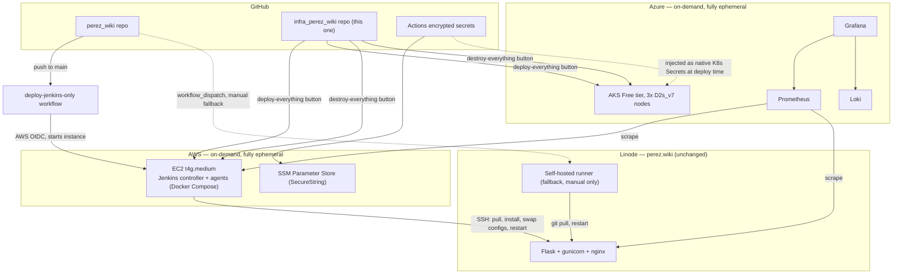

# infra_perez_wiki

Infrastructure for a Jenkins CI cluster (AWS) and a Grafana/Prometheus/Loki monitoring
stack (Azure), built around my [perez_wiki](https://www.perez.wiki) website.

**Status:** the AWS/Jenkins side is real and confirmed working end-to-end — `bootstrap/aws`
and `aws/jenkins/iam` are applied, and `aws/jenkins/compute` deploys automatically via
GitHub Actions (`perez_wiki`'s "Deploy via Jenkins" button → this repo's
`deploy-jenkins-only.yml` → fresh Jenkins instance → real deploy to the Linode box).
The Azure/monitoring side (`bootstrap/azure`, `azure/monitoring`) hasn't been started
yet. See [Build order](#build-order) for what's next.

## Architecture
*Chart produced by Anthropic's Claude*


## Two independent lifecycle paths for Jenkins

1. **Built and working**: `perez_wiki`'s "Deploy via Jenkins" workflow (currently
   `workflow_dispatch`-only, not yet wired to real pushes) calls `deploy-jenkins-only.yml`
   here, which starts a fresh EC2 instance via AWS OIDC, waits for Jenkins via SSM Run
   Command, and triggers the `deploy-perez-wiki` job — which SSHes into the Linode box
   and performs the exact same steps the old self-hosted-runner workflow did (`git pull`,
   reinstall deps, swap the nginx/systemd config files, restart the service).
   **This does NOT self-terminate the instance afterward** — it keeps running
   (and costing money) until torn down via the **"Destroy Jenkins"** workflow
   (`workflow_dispatch`, in this repo's Actions tab) — a deliberate choice:
   manual-but-button-triggered, not automatic, so a deploy can be inspected
   in the Jenkins UI before the instance disappears.
2. **Not yet built**: manual "deploy everything" / "destroy everything" buttons that
   stand up (or tear down) the full Jenkins + monitoring environment together, for demos.

The old self-hosted-runner workflow in `perez_wiki` stays registered on the Linode
box as a **manual fallback** (`workflow_dispatch`, not auto-triggered), in case the
AWS/Jenkins path is ever broken.

## Repo layout

```
bootstrap/
  aws/      APPLIED. TF that creates the S3 bucket used as the remote state
            backend for aws/jenkins (SSE-S3, no customer-managed KMS key
            needed). Uses a deterministic account-ID-based bucket name and
            a guarded `import` block designed for belt-and-suspenders
            idempotent re-runs. That automatic create/import dance
            was never actually wired into `deploy-jenkins-only.yml`, which
            just assumes the bucket already exists (it does, applied
            manually once). See bootstrap/aws/README.md.
  azure/    NOT YET BUILT. Same idea, will create the Azure Storage Account
            + container used as the remote state backend for azure/monitoring.
aws/
  jenkins/
    iam/      APPLIED. OIDC provider + IAM roles. Applied once, manually,
              never destroyed by the on-demand lifecycle. Permission set
              grew from real CI errors (see project memory/history).
              Expect to revisit if new AWS actions get exercised later.
    compute/  WORKING. EC2 instance, security group, SSM parameters, Docker
              Compose (Jenkins + node_exporter). Created every session via
              `terraform apply -replace="aws_instance.jenkins"` (needed
              because plain `apply` hasn't reliably detected user_data
              changes on this resource). Confirmed deploying successfully
              to the real Linode box via full GitHub Actions automation.
azure/
  monitoring/
    iam/    APPLIED. Azure AD app registration + federated credentials
            (two, not one. Azure requires an exact subject match per
            credential, no wildcards like AWS's trust policy) + RBAC role
            assignments. Applied once, manually, never destroyed.
    aks/    IN PROGRESS. First pass written: bare AKS cluster (Free tier),
            node pool (3x D2s_v7. B-series burstable VMs (B2ats_v2,
            B2ps_v2) aren't in this subscription's allowed SKU list at all,
            a Free Trial restriction confirmed in both eastus and eastus2,
            and Free Trial subscriptions can't request quota increases).
            No Helm charts yet. Helm releases
            for Grafana/Prometheus/Loki, Kubernetes Secrets wiring, and
            in-cluster RBAC still to come.
.github/workflows/
  deploy-jenkins-only.yml  BUILT, working. Reusable (on: workflow_call).
                           Applies aws/jenkins/compute (with -replace to
                           force a fresh instance every run), waits for
                           Jenkins via SSM Run Command (not a direct public
                           curl. Port 8080 is only open to admin_cidr,
                           which the runner isn't), then triggers the
                           deploy-perez-wiki job the same way (crumb fetch
                           + POST, both over SSM). Called today from
                           perez_wiki's "Deploy via Jenkins" workflow,
                           which is workflow_dispatch-only (manual button)
                           by design. Flip to `push: branches: [main]`
                           there once confident in this path.
  destroy-jenkins.yml      BUILT, working. Self-contained (not a reusable
                           workflow. No perez_wiki push event drives this,
                           it's a pure admin action), workflow_dispatch-only,
                           triggered directly from this repo's Actions tab.
                           Needs its own copy of the same 4 secrets
                           (LINODE_SSH_PRIVATE_KEY, JENKINS_ADMIN_PASSWORD,
                           EXPORTER_BASIC_AUTH_HASH, ADMIN_CIDR) configured
                           here, since it isn't called from perez_wiki.
  deploy-everything.yml    NOT YET BUILT. Planned: stands up both stacks + wiring.
  destroy-everything.yml   NOT YET BUILT. Would tear down both stacks
                           together; for now, azure/monitoring doesn't
                           exist yet anyway, so destroy-jenkins.yml covers
                           the only thing there currently is to destroy.
```

## Secrets

Source of truth is GitHub Actions encrypted secrets. Materialized at deploy time,
never committed anywhere:

- **AWS side:** SSM Parameter Store, Standard tier, `SecureString` type, encrypted
  with the AWS-managed KMS key (`aws/ssm`) to stay completely free.
- **Azure side:** no Key Vault — injected directly into native Kubernetes Secrets
  at deploy time, since the AKS cluster is fully ephemeral anyway. RBAC is scoped
  per-ServiceAccount (`get` on a specific named Secret, never namespace-wide
  `list`), since native K8s Secrets are base64 in etcd, not encrypted — RBAC is
  the only real access boundary.

**Non-negotiable when writing the Terraform:** state backends must be remote and
encrypted (see `bootstrap/`) and never committed — `sensitive = true` only hides
values from CLI output, not from the state file itself. Secrets are never echoed
in workflow steps, always passed via `env:` (not CLI args), and any Terraform
variable/output touching one is marked `sensitive = true`.

## Cost (on-demand, fully ephemeral)

| Piece | Compute | Per demo-hour | Always-on equivalent (for context) |
|---|---|---|---|
| AWS: EC2 t4g.medium, Jenkins | ~$0.034/hr | ~$0.034/hr | ~$24.82/mo |
| Azure: AKS Free tier, 3x D2s_v7 | ~$0.396/hr | ~$0.396/hr | ~$289/mo |

Azure cost jumped substantially from an original ~$20.58/mo estimate: B-series
burstable VMs (originally planned, ~$0.009-0.067/hr) turned out to not be
available at all on this Free Trial subscription (confirmed in multiple
regions) — Free Trial subscriptions can't request quota increases, so the
cheapest actually-available option is `Standard_D2s_v7` at ~$0.132/hr/node.
Still cheap for the actual on-demand usage pattern, e.g. 40 hours/month
≈ $15.84 (~$16). Just a real, meaningful correction from the original
estimate for anyone tempted to leave it running continuously.

No NAT gateway, no load balancer, no EKS/AKS Standard-tier control-plane fee.
Everything (including state-backend-adjacent storage created outside `bootstrap/`)
is destroyed between sessions — see each module's README once it exists for exact
`terraform destroy` scope and any easy-to-miss lingering resources (Elastic
IPs/Public IPs left allocated-but-unattached, etc.). 

## Build order

1. ✅ `bootstrap/aws` — applied manually, once. (`bootstrap/azure` not started.)
2. ✅ `aws/jenkins` — EC2 + Docker Compose Jenkins, IAM/OIDC, SSM parameters.
   Applied and confirmed working via full GitHub Actions automation.
3. ⬜ `azure/monitoring` — AKS + Helm-installed Grafana/Prometheus/Loki, RBAC,
   Kubernetes Secrets wiring. Not started.
4. ⬜ Cross-cloud scrape config (Prometheus → Jenkins EC2 + Linode box exporters).
5. 🟡 `.github/workflows/` — `deploy-jenkins-only.yml` built and working
   (manual `workflow_dispatch` trigger only, not yet wired to real pushes,
   and doesn't yet self-terminate the instance after deploying).
   `deploy-everything.yml`/`destroy-everything.yml` not started.
6. ⬜ Log upload-on-deploy / download-on-teardown to the user's local machine
   (deferred — lowest priority, tackled after everything else is connected).
